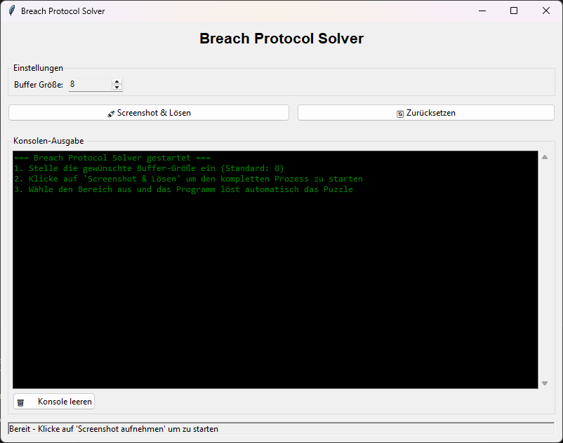

# 🛠️ Breach Hack Automation

Ein Python-Tool zum automatisierten Lösen des "Breach Protocol"-Minispiels in **Cyberpunk 2077**. Dieses Script verwendet Screen-Snipping, Template Matching und eine grafische Benutzeroberfläche (GUI), um die optimale Lösung für das Rätsel zu finden.

---

## 📂 Module

| Datei            | Beschreibung                          |
|------------------|---------------------------------------|
| `snipping.py`    | Screen-Snipping-Modul                |
| `cv2_tmm.py`     | Template-Matching-Modul              |
| `breach_hack.py` | Logik zum Lösen des Breach-Protokolls|
| `breach_gui.py`  | Benutzeroberfläche (GUI)             |

---

## ✨ Benutzeroberfläche

**Screenshot**  


**Demo-Animation**  


---

## 🚀 Features

✅ Automatisches Erfassen des Spielfensters  
✅ Bilderkennung und Template Matching mit OpenCV  
✅ Algorithmus zur optimalen Lösungsfindung  
✅ Benutzerfreundliche grafische Oberfläche zur Bedienung

---

## ⚙️ Installation

```bash
git clone https://github.com/dein-username/dein-repo.git
cd dein-repo
pip install -r requirements.txt
